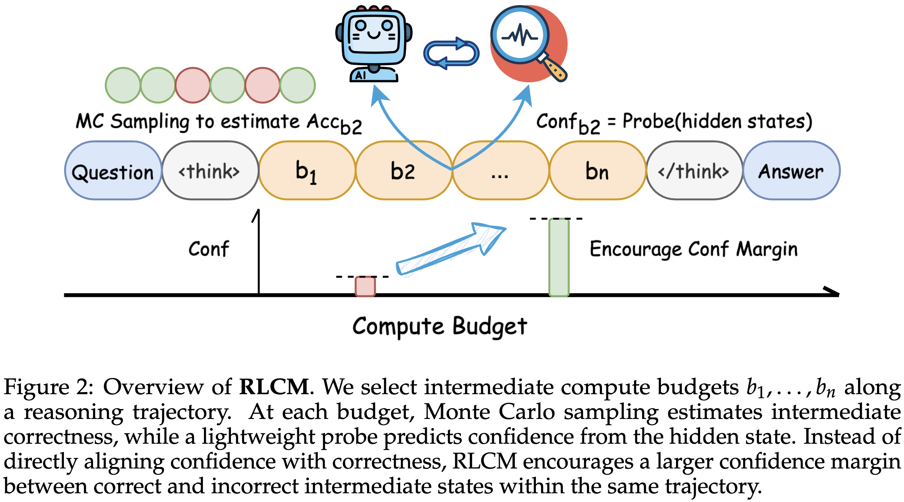

# Process Supervision of Confidence Margin for Calibrated LLM Reasoning

<p align="center">
  <a href="https://arxiv.org/abs/2604.23333"></a>
  <a href="https://huggingface.co/collections/Melodramas/rlcm"></a>
</p>

## RLCM overview

<p align="center">
  
</p>

**RLCM** (Reinforcement Learning with Confidence Margin) is a calibration-aware RL framework. A lightweight probe predicts, from the policy's hidden states, how likely each truncated reasoning prefix is to reach the correct final answer. The training reward augments answer correctness with a margin term that widens the confidence gap between correct and incorrect intermediate states within the same trajectory:

```
R(y) = R_ans(y) + lambda * R_margin(y),   lambda = 0.1
```

## Installation

```bash
bash setup.sh
```

This creates a fresh conda env (`rlcm` by default; override with
`ENV_NAME=... bash setup.sh`) and installs the vendored `verl` fork,
`vllm==0.11.2` (which pins `torch==2.9.0`), `flash-attn==2.8.3`, and the
`rlcm` package. Requires conda; CUDA GPUs required for training
(paper experiments used a single 4x H100 node).

## Data

`deepscaler/data/` ships with everything needed:


| File                                        | Use                                                                                    |
| ------------------------------------------- | -------------------------------------------------------------------------------------- |
| `lead.parquet`                              | RL training set (7,721 problems, GRPO-LEAD stage-1 data with boxed-answer instruction) |
| `lead_RLCR.parquet`                         | Same problems with the RLCR answer/analysis/confidence prompt format                   |
| `stage1_data.json`                          | Raw GRPO-LEAD stage-1 source (provenance for the two files above)                      |
| `aime_filtered.parquet`                     | Validation set used during training                                                    |
| `aime24/25, amc22/23, math, olympiad_bench` | In-domain evaluation benchmarks                                                        |
| `gpqa_diamond, logiqa, livecodebench_lite`  | Out-of-domain evaluation benchmarks                                                    |
| `*_rlcr.parquet`                            | RLCR-format variants of the benchmarks (for the RLCR baseline)                         |


To regenerate the training parquets from `stage1_data.json`:
`python scripts/data/deepscaler_dataset_rlcr.py` (RLCR format) or see
`scripts/data/deepscaler_dataset.py` (boxed format).

## Training

All scripts are run from the repository root. Base model and data paths are set
inside each script (`MODEL_PATH` can be overridden via the CLI).


| Paper experiment                     | Script                                                |
| ------------------------------------ | ----------------------------------------------------- |
| RLCM (main, Table 1)                 | `scripts/train/rlcm.sh`                               |
| GRPO baseline                        | `scripts/train/grpo.sh`                               |
| RLCR baseline                        | `scripts/train/rlcr.sh`                               |
| C2GSPG baseline                      | `scripts/train/c2gspg.sh`                             |
| Final-Brier (Table 2)                | `scripts/train/ablations/final_brier.sh`              |
| Final-Margin (Table 2)               | `scripts/train/ablations/final_margin.sh`             |
| Process-Brier (Table 2)              | `scripts/train/ablations/process_brier.sh`            |
| Qwen3-4B-Instruct RLCM / GRPO / RLCR | `scripts/train/qwen3_4b_instruct/{rlcm,grpo,rlcr}.sh` |


Checkpoints used in the paper: R1-Distill-Qwen-7B runs evaluated at step 600
(Process-Brier at step 560); Qwen3-4B-Instruct runs at step 240. The 7B runs
use verl's default token-mean loss aggregation; for Qwen3-4B-Instruct training
longer than ~240 steps was unstable in our setting.

Note: the original GRPO-baseline launcher was not preserved; `scripts/train/grpo.sh`
re-creates it from the same configuration with standard GRPO advantage
normalization (`algorithm.norm_adv_by_std_in_grpo=True`) and the probe disabled.
The probe used to read out GRPO/Base confidence is trained post-hoc by the
evaluation pipeline (step 4), as described in Appendix B of the paper.

## Evaluation

Evaluation reports two numbers per benchmark — **natural accuracy** (accuracy of
the freely generated trace) and **natural ECE** (calibration of confidence
against that accuracy) — plus a macro average. One command takes a checkpoint
all the way to a results table:

```bash
# RLCM / GRPO / Base: confidence is read out by a trained probe
python scripts/eval/evaluate.py --ckpt checkpoints/<run>/global_step_600 --mode boxed

# RLCR / C2GSPG: the model self-reports <confidence>, no probe needed
python scripts/eval/evaluate.py --ckpt checkpoints/<run>/global_step_600 --mode rlcr \
    --datasets aime24_rlcr,aime25_rlcr,amc23_rlcr,math_rlcr,olympiad_bench_rlcr
```

`evaluate.py` orchestrates the stages (idempotent — a `.<stage>.done` marker plus
non-empty output means skip unless `--force`; use `--dry_run` to print commands):

1. **merge** — convert the verl FSDP `global_step_N/actor` shard to a HuggingFace
  model at `global_step_N/merge` (skipped if `--ckpt` is already an HF dir or a
   `merge/` already exists).
2. `1_obtain_validation_rollouts.py` — sample free-generation rollouts (the
  natural-accuracy source).
3. `2_budget_eval.py` (`2_budget_eval_rlcr.py` in rlcr mode) — forced-answer
  correctness; rlcr mode also parses the self-reported confidence.
4. `3_reproduce_hidden_states_extraction.py` — hidden states *(boxed only)*.
5. `4_probe_training.py` — train the LEAD probe on `--probe_dataset` (default
  `lead`) *(boxed only)*; the same probe is applied to every benchmark.
6. `natural_eval.py` — compute natural accuracy + natural ECE and write
  `results.json` next to the eval outputs.

Stages 1–5 are also runnable standalone. Configs for Qwen3-4B-Instruct evaluation
are in `scripts/eval/configs/probe_training_qwen3_4b/`.

## Paper-to-code terminology


| Paper                       | Code                                                                           |
| --------------------------- | ------------------------------------------------------------------------------ |
| margin reward R_margin      | `probe.reward_mode=conf_diff` (`BudgetProbeTrainer.compute_conf_diff_rewards`) |
| auxiliary weight lambda     | `probe.reward_weight`                                                          |
| confidence probe            | `BudgetProbeMLP` (`verl/verl/trainer/ppo/forced_output/probe_trainer.py`)      |
| compute budgets B(y)        | `forced_output.budget_checkpoints` (fractions of the max length)               |
| MC intermediate correctness | `forced_output.num_forced_answers` forced completions per budget               |
| Final-Margin ablation       | `probe.reward_mode=conf_diff_v3` with `budget_checkpoints=[1.0]`               |
| Brier reward / Final-Brier  | `probe.reward_mode=brier`                                                      |
| RLCR baseline reward        | `verl/verl/utils/reward_score/rlcr.py`                                         |
| natural accuracy / ECE      | `scripts/eval/natural_eval.py`, `scripts/eval/metric_utils.py`                 |


## Tests

CPU-only unit tests pin down the behavior of the margin reward, probe, RLCR
scoring, calibration metrics, answer grading, and data preparation:

```bash
python -m pytest tests/ -v
```

## Acknowledgements

This codebase builds on [verl](https://github.com/volcengine/verl) and the
[AnytimeReasoner](https://github.com/sail-sg/AnytimeReasoner) training recipe.
Training data derives from [GRPO-LEAD](https://arxiv.org/abs/2504.09696).

## License

Apache License 2.0 (see `LICENSE`).

## Citation

```bibtex
@misc{wang2026processsupervisionconfidencemargin,
      title={Process Supervision of Confidence Margin for Calibrated LLM Reasoning},
      author={Liaoyaqi Wang and Chunsheng Zuo and William Jurayj and Benjamin Van Durme and Anqi Liu},
      year={2026},
      eprint={2604.23333},
      archivePrefix={arXiv},
      primaryClass={cs.LG},
      url={https://arxiv.org/abs/2604.23333},
}
```

